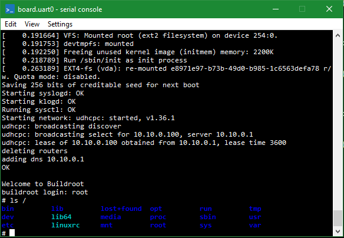
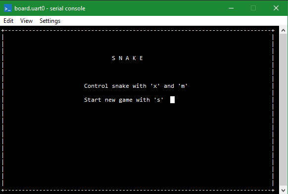

# Internet-of-things demo/teaching setup.

## Original objectives:

▪ Start from RISC-V simple

▪ Add some models of sensors and actuators

▪ Write a physics model for some physical systems (preferably one with feedback effects)

▪ Write a control program that runs on the RISC-V – either on Linux (requires custom driver), bare metal

▪ Simulate the system under various disturbances

## Key pieces:

▪ Model a sensor in Simics

▪ Put sensor into memory map

▪ Write code to read-write it

▪ Build a Physics model in Python – run in Simics

▪ Connect sensor model to physics model

▪ Model an actuator

▪ Write control loop code thatreads sensor, drives actuator

▪ ”Kick” the physics model

# What is done:

1. We installed Simics on Windows and Linux.
2. We acquired the RISC-V toolchain from buildroot by compiling it.
3. We loaded RISC-V machine in Simics.
4. We compiled and tested the baremetal snake example.
5. We read the Simics documentation.
6. We created a skeleton device in dml with read function that returned the register value.
7. We compiled the device model on Windows and Linux.
8. We read from and wrote to device register from command line in the vacuum.
9. We made a simple module test in python that checks the register value.
10. We tested the device in the Simics vaccum.
11. We wrote basic application in c and compiled it using riscv64-linux-gcc compilator.

# Steps to reproduce our project:

### Simics instalation and RISC-V simple platform:

1. Install Simics on Linux to avoid having to install the mingw compiler. Link to Simics instalation guide: https://www.intel.com/content/www/us/en/developer/articles/guide/simics-simulator-installation.html.
2. Create a new Simics project.
3. To create a RISC-V system you can use prebuilt images from "linux-images.zip" or build it with buildroot.
4. If you want to use Buildroot:
   
   * Clone the buildroot using: "git clone https://github.com/buildroot/buildroot.git".
   * Use simics_simple_riscv_defconfig configuration file: "make simics_simple_riscv_defconfig".
   * Build the buildroot with make.

5. Copy Image, rootfs.ext2 and fw_jump.elf to "[project]/targets/risc-v-simple/images/linux" directory.
6. Start a new Simics simulation session with: "./simics".
7. Load the RISC-V simple target script from the Simics simulator command line: load-target target = "risc-v-simple/linux".
8. Run the simulation with run command.

### Running the snake example:

1. Compile the baremetal example with: make CROSS_PREFIX=riscv64-unknown-elf-.
2. Move risc-v-baremetal directory to "targets" directory in your existing Simics project.
3. Start a new Simics simulation with "./simics" and run command: load-target target = "risc-v-baremetal/bare-metal".
4. Start the simulation with run command.

### Creating device model and testing it in the vaccum:

1. To access modeling device guide go to the Simics documentation and find: USER'S GUIDES/Model Builder User's Guide/II Device Modeling/4 Overview.
2. To set up a project go to the project directory and in the linux terminal run: run "/bin/project-setup".
3. To build a device skeleton run: "./bin/project-setup --device=simple_device".
4. In order to modify the device and run it in the vaccum you can proceed with guide or copy the contents of simple_device directory from this github repository.
5. Copy "my-vacuum.simics" script to the "[project]/targets/vacuum/my-vacuum.simics" directory.
6. Run "./simics targets/vacuum/my-vacuum.simics" in the linux terminal to start the simics simulation and execute the vacuum script.
7. You can use "phys_mem.write 0x1000 0xff -l" to write number "255" to the register and "phys_mem.read 0x1000 -l" to read from the device register.

# What didn't work and encountered problems:

* Mingw broke on Windows randomly.
* Time management.
* Very limited time for the whole project.

# Future steps:

1. Create a standalone application that will communicate with the device.
2. Create a simple sensor and connect it to the application.
3. Create an actuator and connect it to the application and the sensor.

# What we don't know:

* How to make a working application and how to transport it to the RISC-V machine.
* How to create an actuator for simics.

# What we learned:

* How to use English in work environment. 
* How to work in the group.
* How to compile C programs for RISC-V.
* How to use Simics and how does it work.
